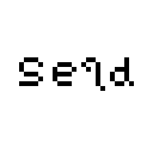
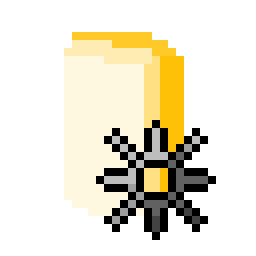

<h1 align="center">
  👋 Hello, I'm Shaiya
</h1>

  
  
  
  

I also go by "Nishi" or "ShaiyaJ". I'm a hobbyist programmer and student who focuses on writing tools and libraries, usually in lower level languages, with the occasional game coming along. 

<h3 align="center">
  ✍️ Writing in... ✍️
</h3>

  
  
  
  
  
  

<h3 align="center">
  🌱 Learning... 🌱
</h3>

  
  
  
  
  

<h3 align="center">
  ✏️ Working on... ✏️
</h3>

### [Seqd](https://github.com/ShaiyaJ/seqd)
A C single-header library for displaying ANSI escape sequences in the terminal. Allowing programmers to easy add colors and styles to their console apps and TUIs.

### [MahTools](https://github.com/mahtools)
Collection of tools relating to Riichi Mahjong (and select other East Asian games), primarily web apps to aid both learning and during play 
