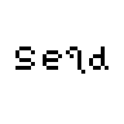

<h1 align="center">
  👋 Hello, I'm Shaiya
</h1>

  
  <!-- -->
  <!---->
  

I also go by "Nishi" or "ShaiyaJ". I'm a hobbyist programmer with a passion for building tools and libraries. I enjoy diving into low-level systems, but I also work with high-level languages to build practical, fun projects.

<h3 align="center">
  ✍️ Writing in... ✍️
</h3>

  
  
  
  
  
  

<h3 align="center">
  🌱 Learning... 🌱
</h3>

  
  
  
  
  
  

<!--
<h3 align="center">
  ✏️ Working on... ✏️
</h3>
-->

<!--
### ⚫ di... [seq](https://github.com/ShaiyaJ/diseq), [pixel](https://github.com/ShaiyaJ/dipixel)
Various stb-style libraries for developing terminal applications

### ⚫ [snob](https://github.com/ShaiyaJ/snob) 
A C build system that allows you to define your build system inside of the source code itself

### 🔵 [exdoc](https://github.com/ShaiyaJ/exdoc)
A tool that allows you to pipe the output of commands into a word document
-->

<!--

### ⚫ [Seqd](https://github.com/ShaiyaJ/seqd)
A lightweight, single-header C library for ANSI styling in the terminal. Perfect for adding color and life to your CLI tools or TUI apps with minimal hassle!

 

・

### 🟡 [One More Framework](https://github.com/ShaiyaJ/omf)
A lightweight frontend framework giving you components, local state, component re-rendering - all in under 100 lines of code!
-->
